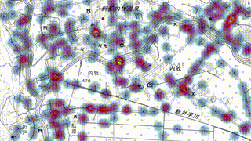

# GIS Day in 東京 2023 Eコース「マルチエージェントシミュレーションを使った人の動きのシミュレーション」リポジトリ

* マルチエージェントシミュレーションを使った人の動きのシミュレーション
* 2023年11月18日 東京都立大学 南大沢キャンパス
* 東京都立大学 都市環境学部 地理環境学科 中山大地
* このテキストのURL [https://github.com/bokutachi256/gisday2023](https://github.com/bokutachi256/gisday2023)
* Google ColaboratoryのURL [https://colab.research.google.com/](https://colab.research.google.com/)

# 内容
* [テキスト](https://github.com/bokutachi256/gisday2023/blob/main/GISDay2023_%E3%83%86%E3%82%AD%E3%82%B9%E3%83%88.md)
* [プログラム](https://github.com/bokutachi256/gisday2023/blob/main/GISDay2023_%E3%83%97%E3%83%AD%E3%82%B0%E3%83%A9%E3%83%A0.ipynb)
* [サンプルデータ](https://github.com/bokutachi256/gisday2023/tree/main/sample_data)

  
